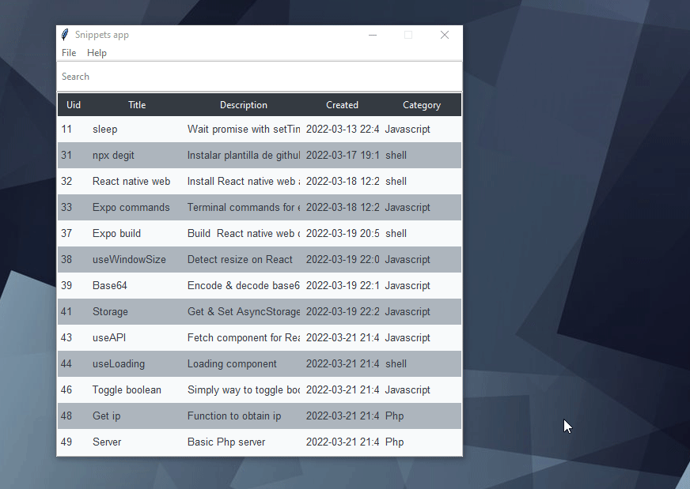

# tksnippets

Simple snippets app made with Python and Tkinter

### Requirements

    python -m venv venv
    python -m pip install -r requirements.txt

### Package with Pyinstaller

You can create a build.bat or build.sh with this content.

    pyinstaller main.py ^
        --onefile ^
        --clean ^
        --windowed --noconsole ^
        --hidden-import "clr" --name "Snippets" ^
        --icon "icon.ico"

Now copy storage folder inside dist folder and voila!

